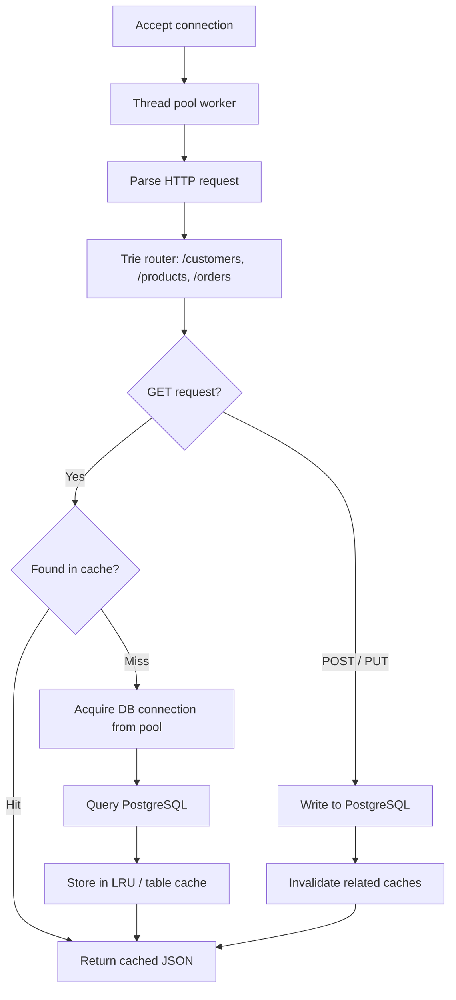

# 🌐 HTTP Server with Load Balancer (C++)

A **multi-threaded HTTP server built from scratch in C++** using raw TCP sockets, backed by **PostgreSQL**.
Three identical backend servers run behind a custom **least-connections load balancer** with automatic health checking and failover.
Each server has its own **thread pool, database connection pool, LRU cache, table cache and Trie-based router**.


-0078D6?logo=windows)

---

## 📌 Table of Contents

- [Features](#-features)
- [Tech Stack](#-tech-stack)
- [Architecture](#-architecture)
- [Project Structure](#-project-structure)
- [Getting Started](#-getting-started)
- [How the Load Balancer Works](#-how-the-load-balancer-works)
- [Server Internals](#-server-internals)
- [API Reference](#-api-reference)

---

## ✨ Features

**Load Balancer**
- Listens on port `7000` and distributes client requests across **3 backend servers**
- **Least-connections** strategy — each request goes to the healthy backend with the fewest active connections
- **Backend health checking** every 2 seconds, with automatic recovery when a server comes back
- **Failover** — if a backend refuses a connection, the next one is tried; returns `503 Service Unavailable` only if none are reachable
- **Fixed pool of 128 worker threads** fed by a client queue (no thread-per-connection)
- Relays raw TCP traffic between client and backend

**HTTP Server**
- Hand-written HTTP parsing and response building over **TCP sockets** (Winsock)
- REST endpoints for **Customers, Products and Orders** (`GET`, `POST`, `PUT`)
- **Thread pool** (8 workers per server) to handle requests concurrently
- **Connection pool** — 15 reusable PostgreSQL connections shared safely across threads
- **Trie-based router** for route matching
- **LRU cache** for single-record lookups (`GET /customers?id=1`)
- **Table cache** for full-table results (`GET /customers`), invalidated on writes
- JSON request/response handling with proper HTTP status codes (`200, 201, 400, 404, 405, 409, 500`)

---

## 🧰 Tech Stack

| Layer | Technology |
|---|---|
| Language | C++ |
| Networking | TCP sockets (Winsock2) |
| Concurrency | `std::thread`, `std::mutex`, `std::condition_variable`, `std::atomic` |
| Database | PostgreSQL via `libpqxx` |
| JSON | nlohmann/json |
| Compiler / Environment | G++ on MSYS2 UCRT64 (Windows) |

---

## 🏗️ Architecture

```text
                    Client
                       |
                  Port 7000
                       |
                 Load Balancer
                 /      |      \
                /       |       \
               ↓        ↓        ↓
        Server 1    Server 2    Server 3
        Port 8080   Port 8000   Port 9000
               \        |        /
                \       |       /
                 PostgreSQL
                   Port 5432
```

**Request flow inside one backend server**



### Ports

| Component | Port |
|---|---|
| Load Balancer | 7000 |
| Server 1 | 8080 |
| Server 2 | 8000 |
| Server 3 | 9000 |
| PostgreSQL | 5432 |

---

## 📁 Project Structure

```text
HttpServerProject/
│
├── Server/                          # Shared code used by all three servers
│   ├── include/
│   │   ├── Common.h                 # Common includes
│   │   ├── Config.h                 # Database connection settings
│   │   ├── ConnectionPool.h         # PostgreSQL connection pool
│   │   ├── DataStore.h              # SQL access layer interface
│   │   ├── HTTPRequest.h            # Request structure
│   │   ├── HTTPServer.h             # Server class
│   │   ├── LRUCache.h               # Key-value LRU cache
│   │   ├── TableCache.h             # Whole-table cache
│   │   ├── ThreadPool.h             # Task queue + worker threads
│   │   └── TrieRouter.h             # Trie-based router
│   │
│   └── src/
│       ├── DataStore_Customers.cpp
│       ├── DataStore_Orders.cpp
│       ├── DataStore_Products.cpp
│       ├── HTTPServer.cpp           # Setup, parsing, accept loop
│       ├── HTTPServer_Customers.cpp
│       ├── HTTPServer_Orders.cpp
│       └── HTTPServer_Products.cpp
│
├── Server1/main.cpp                 # Runs on port 8080
├── Server2/main.cpp                 # Runs on port 8000
├── Server3/main.cpp                 # Runs on port 9000
│
├── LoadBalancer/
│   ├── include/
│   │   ├── BackendServer.h          # Backend state (health, active connections)
│   │   ├── Common.h                 # Load balancer configuration
│   │   └── LoadBalancer.h
│   ├── src/
│   │   ├── LoadBalancer.cpp         # Health checks, socket helpers
│   │   ├── LoadBalancer_Init.cpp    # Socket setup + accept loop
│   │   └── LoadBalancer_Relay.cpp   # Backend selection, relay, worker threads
│   └── main/main.cpp
│
└── README.md
```

---

## 🚀 Getting Started

### Requirements

Install the following:

- MSYS2 UCRT64
- GCC / G++
- PostgreSQL
- libpqxx
- nlohmann/json

The project uses C++, Winsock, libpqxx, PostgreSQL, and nlohmann/json.

### Database

The servers connect to PostgreSQL using:

```text
Host:     127.0.0.1
Port:     5432
Database: HttpServerDB
User:     postgres
```

Set your own PostgreSQL password in `Server/include/Config.h` (`DB_CONNECTION`).

Make sure PostgreSQL is running, and that the `HttpServerDB` database exists
with the required tables, before starting the servers.

<details>
<summary><b>Reference schema (based on the SQL queries in the code)</b></summary>

```sql
CREATE DATABASE "HttpServerDB";

-- connect to HttpServerDB, then:

CREATE TABLE customers (
    customer_id SERIAL PRIMARY KEY,
    name        VARCHAR(255) NOT NULL,
    email       VARCHAR(255) NOT NULL UNIQUE
);

CREATE TABLE products (
    product_id  SERIAL PRIMARY KEY,
    name        VARCHAR(255) NOT NULL,
    price       NUMERIC(12, 2) NOT NULL,
    stock       INTEGER NOT NULL
);

CREATE TABLE orders (
    order_id    SERIAL PRIMARY KEY,
    customer_id INTEGER NOT NULL REFERENCES customers(customer_id),
    product_id  INTEGER NOT NULL REFERENCES products(product_id),
    quantity    INTEGER NOT NULL
);
```

</details>

---

### Build and Run

Open **4 separate MSYS2 UCRT64 terminals** — one per component.

#### Terminal 1 — Server 1

```bash
cd "C:\Users\ASUS\Downloads\HttpServerProject\HttpServerProject\HTTP_Server\Server"

g++ -Iinclude src/DataStore_Customers.cpp src/DataStore_Products.cpp src/DataStore_Orders.cpp src/HTTPServer.cpp src/HTTPServer_Customers.cpp src/HTTPServer_Products.cpp src/HTTPServer_Orders.cpp ../Server1/main.cpp -lpqxx -lpq -lws2_32 -o Server1.exe

./Server1.exe
```

Runs on `http://127.0.0.1:8080`

#### Terminal 2 — Server 2

```bash
cd "C:\Users\ASUS\Downloads\HttpServerProject\HttpServerProject\HTTP_Server\Server"

g++ -Iinclude src/DataStore_Customers.cpp src/DataStore_Products.cpp src/DataStore_Orders.cpp src/HTTPServer.cpp src/HTTPServer_Customers.cpp src/HTTPServer_Products.cpp src/HTTPServer_Orders.cpp ../Server2/main.cpp -lpqxx -lpq -lws2_32 -o Server2.exe

./Server2.exe
```

Runs on `http://127.0.0.1:8000`

#### Terminal 3 — Server 3

```bash
cd "C:\Users\ASUS\Downloads\HttpServerProject\HttpServerProject\HTTP_Server\Server"

g++ -Iinclude src/DataStore_Customers.cpp src/DataStore_Products.cpp src/DataStore_Orders.cpp src/HTTPServer.cpp src/HTTPServer_Customers.cpp src/HTTPServer_Products.cpp src/HTTPServer_Orders.cpp ../Server3/main.cpp -lpqxx -lpq -lws2_32 -o Server3.exe

./Server3.exe
```

Runs on `http://127.0.0.1:9000`

#### Terminal 4 — Load Balancer

```bash
cd "C:\Users\ASUS\Downloads\HttpServerProject\HttpServerProject\HTTP_Server\LoadBalancer"

g++ -Iinclude src/LoadBalancer.cpp src/LoadBalancer_Init.cpp src/LoadBalancer_Relay.cpp main/main.cpp -lws2_32 -o LoadBalancer.exe

./LoadBalancer.exe
```

Runs on `http://127.0.0.1:7000`

> Adjust the `cd` path to wherever you saved the project on your machine.

---

### Start Order

Always start components in this order:

1. PostgreSQL
2. Server 1
3. Server 2
4. Server 3
5. Load Balancer

The load balancer health-checks the backend servers, so all three servers
should already be running before you start it.

### Quick test

Send all requests to the **load balancer** on port `7000`:

```bash
curl http://127.0.0.1:7000/
```

---

## ⚖️ How the Load Balancer Works

The load balancer listens on port `7000`. When a client sends a request:

```text
Client
   |
   ↓
Load Balancer :7000
   |
   ├── Server 1 :8080
   ├── Server 2 :8000
   └── Server 3 :9000
```

1. **Accept** — the main thread accepts the client connection and puts it in a queue.
2. **Worker picks it up** — one of the 128 worker threads takes the connection from the queue.
3. **Select a backend** — healthy backends are sorted by their number of **active connections**; the least busy one is tried first.
4. **Failover** — if the connection to that backend fails, it is marked unhealthy and the next backend is tried. If every backend is down, the client receives `503 Service Unavailable`.
5. **Relay** — data is forwarded in both directions between client and backend until either side closes.
6. **Health checker** — a background thread tries to connect to every backend every 2 seconds, marking servers as unavailable or recovered.

| Setting | Value |
|---|---|
| Listen port | 7000 |
| Worker threads | 128 |
| Health check interval | 2 seconds |
| Backend connect timeout | 3 seconds |
| Socket timeout | 30 seconds |
| Listen backlog | 1024 |

---

## 🔧 Server Internals

All three servers run the same code — only the port differs (`8080 / 8000 / 9000`).

| Component | What it does |
|---|---|
| **HTTP Server** | Accepts TCP connections, parses requests, and builds JSON responses for Customers, Products and Orders |
| **Thread Pool** | 8 worker threads per server pull tasks from a thread-safe queue, so many requests run concurrently |
| **Connection Pool** | 15 PostgreSQL connections created at startup and leased to requests; threads wait when all are in use |
| **LRU Cache** | Caches individual records (capacity 100 each for customers, products, orders) using a linked list + hash map for O(1) get/put |
| **Table Cache** | Caches the full result of `GET /customers`, `/products`, `/orders`; cleared whenever a row changes |
| **Trie Router** | Matches request paths (`/`, `/customers`, `/products`, `/orders`) using a Trie |
| **Data Store** | All SQL lives here; every call leases a pooled connection and runs a parameterized transaction |

**Cache behaviour**

| Operation | Effect on cache |
|---|---|
| `GET /customers` | Served from table cache if present, otherwise loaded from DB and cached |
| `GET /customers?id=1` | Served from LRU cache if present, otherwise loaded from DB and cached |
| `POST` | Table cache cleared |
| `PUT` | Record removed from LRU cache and table cache cleared |

The same behaviour applies to `/products` and `/orders`.

---

## 📡 API Reference

Base URL (through the load balancer): `http://127.0.0.1:7000`

| Method | Endpoint | Description |
|---|---|---|
| GET | `/` | Server status (JSON) |
| GET | `/customers` | List all customers |
| GET | `/customers?id=1` | Get one customer |
| POST | `/customers` | Create customer |
| PUT | `/customers` | Update customer (ID is sent in the body) |
| GET | `/products` | List all products |
| GET | `/products?id=1` | Get one product |
| POST | `/products` | Create product |
| PUT | `/products` | Update product |
| GET | `/orders` | List all orders |
| GET | `/orders?id=1` | Get one order |
| POST | `/orders` | Create order |
| PUT | `/orders` | Update order |

### Example requests

**Create a customer**
```bash
curl -X POST http://127.0.0.1:7000/customers \
  -H "Content-Type: application/json" \
  -d '{ "name": "John Doe", "email": "john@example.com" }'
```

**Update a customer**
```bash
curl -X PUT http://127.0.0.1:7000/customers \
  -H "Content-Type: application/json" \
  -d '{ "customer_id": 1, "name": "John D", "email": "john@example.com" }'
```

**Create a product**
```bash
curl -X POST http://127.0.0.1:7000/products \
  -H "Content-Type: application/json" \
  -d '{ "name": "Wireless Mouse", "price": 19.99, "stock": 100 }'
```

**Update a product**
```bash
curl -X PUT http://127.0.0.1:7000/products \
  -H "Content-Type: application/json" \
  -d '{ "product_id": 1, "name": "Wireless Mouse", "price": 17.99, "stock": 90 }'
```

**Create an order**
```bash
curl -X POST http://127.0.0.1:7000/orders \
  -H "Content-Type: application/json" \
  -d '{ "customer_id": 1, "product_id": 1, "quantity": 2 }'
```

**Update an order**
```bash
curl -X PUT http://127.0.0.1:7000/orders \
  -H "Content-Type: application/json" \
  -d '{ "order_id": 1, "customer_id": 1, "product_id": 1, "quantity": 3 }'
```

**Get data**
```bash
curl http://127.0.0.1:7000/customers
curl "http://127.0.0.1:7000/customers?id=1"
curl http://127.0.0.1:7000/products
curl http://127.0.0.1:7000/orders
```

### Response codes

| Code | Meaning |
|---|---|
| 200 | Success |
| 201 | Created |
| 400 | Invalid request, missing field, or invalid foreign key |
| 404 | Unknown endpoint |
| 405 | Method not allowed |
| 409 | Duplicate value (e.g. email already exists) |
| 500 | Database error |
| 503 | No backend server available (from the load balancer) |
